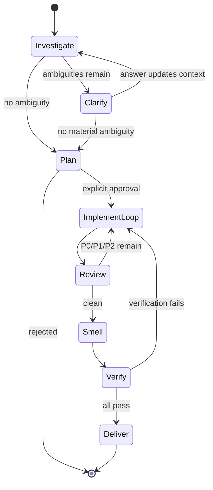

# Forge Loop

Build a feature or change through an approval-gated plan and an unbroken implement/review loop. Clarify away ambiguity, get explicit approval, loop until review is clean and verification passes, then deliver (open a PR by default, or commit if the user opted out).

## When to use

- Starting implementation from scratch.
- The user provides an issue, ticket, or task to implement.

## When not to use

- The next action is an obvious small edit.
- The request is purely explanation or investigation.
- A pull request already exists and only review is needed.

## Delivery mode

By default the loop ends with an opened PR. If the user states upfront (or during planning) that no PR is wanted, the loop ends with committed work on the current branch instead, and the final message states that a PR was intentionally skipped. Otherwise always open a PR.

## Language rule

Pick the language from the conversation, not from the loaded task, ticket, logs, or code. Localize the fixed template labels (`Findings`, etc.) to the conversation language; keep the option markers `A)`/`B)`/`C)` and the priority markers `P0`/`P1`/`P2`/`P3` verbatim.

## Workflow

One-line summary per phase:

1. **Investigate** — survey the project context (pre-approval).
2. **Clarify** — default one question at a time until no material ambiguity remains.
3. **Plan** — write the persistent plan and wait for explicit approval.
4. **Implement / review loop** — one implement pass + one review pass per iteration until clean; `rework-tracker` guards the safety valve.
5. **Verify & deliver** — `smell-detector` scans for out-of-scope recurrence, `verifier` runs repo verification, then `deliverer` opens the PR (or commits if opted out).

## Phase 1: Investigate (pre-approval)

Pre-approval: do not start sub-agents and do not implement. The main agent surveys the current project context itself.

Inspect each applicable angle and verify at least one concrete artifact per angle, stating what was checked. For angles that do not apply, say so.

- Code
- Documentation
- Tests
- Existing plans or prior implementation records
- Local instructions

Once every applicable angle has been inspected, emit the investigation block from [TEMPLATES.md](TEMPLATES.md). Do not omit it even when there is no ambiguity; if no question is needed, write `Next clarifying question: none` and proceed to Phase 3.

## Phase 2: Clarifying questions

While material ambiguity remains, default to one clarifying question at a time. A material ambiguity is uncertainty that could change implementation shape, validation, rollout, data handling, permissions, or visible user behavior.

Decide what to ask by applying this filter first:

- **Resolve from artifacts, do not ask**: behavior inferable from existing code, tests, or repository instructions (e.g. naming conventions, framework defaults, lint rules). Read more of the project before asking.
- **Always ask the user**: anything touching permissions, data handling/retention, security, rollout/visibility, or external product behavior that no artifact pins down.
- **Ask only if still open after artifact review**: scope boundaries, validation thresholds, and integration points where reasonable defaults exist but the user may have a strong preference.

Exceptions to one-question-at-a-time:

- If two or more ambiguities are tightly coupled (answering one forces the others), combine them into a single question with `A)`/`B)`/`C)` options that bundle the decisions.
- Never combine independent ambiguities that could each yield a distinct answer.

Option format (applies to every question, single or bundled):

- Options are `A)`/`B)` and an optional `C)` only — mutually exclusive and actionable, at most three.
- Keep labels short and neutral; avoid strawman phrasing.
- Each option states its impact and the implementation work it implies.
- Always follow the options with `Recommendation:`.
- Re-emit the full investigation block after each answer, then ask the next question.

Do not ask the user to decide ordinary implementation details that the local code, tests, or repository instructions can answer.

## Phase 3: Plan gate and approval

Do not write the plan until every material ambiguity is resolved. If the user chooses to leave an ambiguity unresolved, record that choice itself as a settled decision.

Write the plan where the repository expects persistent implementation plans. With no convention, use `docs/plans/plan_YYYYMMDDHHMMSS_<short-slug>.md` and create directories as needed. Use the plan template in [TEMPLATES.md](TEMPLATES.md). `Resolved open questions` maps every former open ambiguity to a settled decision.

State the exact plan file path, say that work proceeds once the user approves, and wait for explicit approval. Explicit approval means a clear affirmative (for example `approve`, `approved`, `go`, `proceed`, `ok to start`, or an explicit yes to "should I proceed?"). Ambiguous acknowledgements (`ok`, `sure`, `了解`, `わかった`) are not approval; ask again. If the user opts out of a PR here, record that choice in `Decisions` and follow the Delivery mode.

## Phase 4: Implement / review loop (post-approval)

After explicit approval, keep looping automatically until the user redirects or a genuine product judgment is needed.

- The main agent orchestrates only: it summarizes, delegates, inspects output, and evaluates findings. If sub-agents are available, the main agent does not edit files directly.
- One iteration = exactly one implement pass (the `implementer` sub-agent) and one review pass (the `reviewer` sub-agent).
- Keep implement and review contexts clean. Pass the implementer/reviewer exactly what their contracts require, not the main agent's full context.
- Reuse implement/review sessions only when they stay format-compliant and useful.

## Sub-agents

This skill delegates Phase 4 and Phase 5 work to four sub-agents, defined alongside this skill and deployed by APM into each harness's agents directory:

- `implementer` — executes one implement pass per dispatch. Contract: changed files, validation results, residual risks or blockers, and whether the approved scope is fully complete.
- `reviewer` — executes one review pass per dispatch. Contract: a flat list of `P0`/`P1`/`P2`/`P3` findings, or the exact phrase `No findings`.
- `verifier` — executes one verify pass per dispatch (Phase 5). Contract: a `Validation` table (`pass | fail | unavailable`), failures-as-findings, and `All pass: yes | no`.
- `deliverer` — executes one deliver pass per dispatch (Phase 5). Contract: delivery mode and PR URL/commit list, plan references, and `PR skipped: yes | no`.

Dispatch by harness:

| Harness | How to dispatch |
|---------|-----------------|
| Cursor | `Task` tool with `subagent_type: "implementer"` / `"reviewer"` / `"verifier"` / `"deliverer"` |
| Claude Code | `Agent` tool with the `implementer` / `reviewer` / `verifier` / `deliverer` agent name |
| Codex | Read the deployed agent file and `spawn_agent(agent_type="worker", message=...)` with its content as the message body |

If a harness has no sub-agent mechanism, the main agent runs each pass inline using the same contracts, and states that sub-agents were unavailable.

Each implement dispatch must pass the `implementer`:

- the approved goal and non-goals;
- validation expectations;
- target files or responsibilities;
- findings to fix in this rework pass (empty on the first pass);
- the approved scope boundary.

The `implementer` fixes the same root-cause issue across the whole approved scope and does not revert unrelated edits. If its output is incomplete, out of scope, or off-format, run a compliant replacement implement pass before review.

Loop safety valve: track consecutive failed rework passes deterministically with the `rework-tracker` skill. Before each re-dispatch of the `implementer` against the same root cause, call `rework-tracker` with the root-cause id and the implementer's last result (`compliant` | `incomplete` | `invalid`); it returns `continue` or `stop`. On `stop` (three consecutive `incomplete`/`invalid` against the same root cause), halt auto-looping and report the blocker to the user with the last attempts summarized. Resume only after user input. Do not spin indefinitely on a stuck rework. A `compliant` pass or a change of root cause resets the counter.

After each implement pass, dispatch the `reviewer` with an explicit review target (uncommitted changes, a commit range, or a PR number).

Do not accept a clean review unless every prior finding is addressed or explicitly overridden by a documented user decision. If unresolved P0/P1/P2 remain, run another implement pass that fixes the root cause across the approved scope, then re-review.

Fix P3 in a separate, dedicated pass (not bundled with P0/P1/P2 rework), and only when trivial and churn-free. If a P3 fix introduces new findings, treat those as normal review findings rather than reverting the fix.

Implementation completion is not the stop condition. Exit the loop only when review returns `No findings` and the main agent confirms no residual P0/P1/P2.

Before moving to Phase 5, run the `smell-detector` skill once. Derive a search pattern from the reviewer's root-cause description, scan the whole repository for the same pattern outside the approved scope, and list any matches as residual risks for the plan's `Risks` field. Matches are warnings, not blockers: they do not re-enter the Phase 4 loop and do not block delivery. Surface them to the user and proceed.

## Phase 5: Verify and deliver

Once review is clean, verify before delivery.

Dispatch the `verifier` sub-agent with the verification target (uncommitted changes, a commit range, or a PR number), the validation commands available in the repo, and the plan's `Validation` field. It runs the tests, static analysis, type check, linter, and build, and returns a `Validation` table with `All pass: yes | no`. If a step is genuinely unavailable (no test suite, no configured linter, broken toolchain outside the change scope), the `verifier` states that explicitly, runs the strongest available alternative, and records the gap; record any such gap in the plan's `Risks`.

On `All pass: no`, feed the failures back into the Phase 4 loop as new findings: run an `implementer` pass that fixes them, re-review, then verify again. Do not deliver on a failing verification.

When the `verifier` returns `All pass: yes` (or all gaps are explicitly recorded), dispatch the `deliverer` sub-agent with the plan file path, the final diff range, the delivery mode (`pr` default, or `commit` when the user opted out and `Decisions` records that), and the referenced issue/ticket/task.

- In PR mode (default), the `deliverer` opens the PR, authoring the body from the plan's `Goal`/`Decisions`/`Resolved open questions`, referencing the resolved ticket, and returning the PR URL or number.
- In commit mode, the `deliverer` commits to the current branch, splitting commits along the plan's `Steps`, following the repo's commit-message convention if one exists, and returning `PR skipped: yes` per the recorded decision.

If a harness has no sub-agent mechanism, the main agent runs the verify and deliver passes inline using the same contracts, and states that sub-agents were unavailable.

## Review severity

The `P0`/`P1`/`P2`/`P3` definitions and the P3 handling rule live in the `reviewer` sub-agent's contract. See `.apm/agents/reviewer.agent.md`.

## Companion skills

Two skills support the Phase 4 loop deterministically:

- `rework-tracker` — counts consecutive failed rework passes per root cause and trips the safety valve after three. See `.apm/skills/rework-tracker/SKILL.md`.
- `smell-detector` — scans the whole repo for the same root-cause pattern outside the approved scope and lists matches as residual risks. See `.apm/skills/smell-detector/SKILL.md`.
