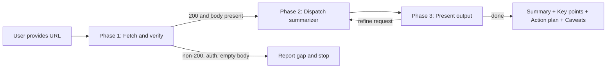

# URL Summarize

Fetch a single URL, summarize it into a compact digest, and present an actionable next-step plan the user can act on immediately.

## When to use

- The user provides one URL and wants a summary, digest, or recap.
- The user wants to understand a web page or article quickly.

## When not to use

- Multiple URLs to merge into one digest.
- Translation, side-by-side comparison, or Q&A generation from a URL.
- The request is about code in the repository, not external web content.

## Language rule

Pick the language from the conversation, not from the fetched page. Localize the fixed template labels (`Summary`, `Key points`, `Action plan`, `Caveats`, `Source`) to the conversation language; keep the marker tokens `Content insufficient` verbatim.

## Workflow



One-line summary per phase:

1. **Fetch and verify** — the main agent fetches the URL and confirms usable content exists.
2. **Dispatch summarizer** — one summarizer pass produces the structured digest.
3. **Present** — emit the output template verbatim; re-dispatch on refine requests.

## Phase 1: Fetch and verify

The main agent fetches the URL itself. Do not dispatch the summarizer before content is available.

1. Fetch with `WebFetch`.
   - If the payload is large and the `md2idx-read` skill is available, use it: fetch the index first, then retrieve only the sections needed.
   - If `md2idx-read` is not available, use the full `WebFetch` body. When it exceeds practical context limits, summarize from the leading portion and note truncation in `Caveats` — do not invent content from the URL alone.
2. Verify usable content:
   - HTTP 200 (or equivalent successful fetch).
   - Not behind authentication the agent cannot satisfy.
   - Not binary or non-text content without extractable text.
   - Not an empty body from JS-only SPA shells or blocked pages.
3. If verification fails, report the gap to the user and stop. Do not invent a summary from the URL alone.

Extract or infer a page title from the fetched content when available.

## Phase 2: Dispatch summarizer

Dispatch the `summarizer` sub-agent with exactly:

- the URL;
- the fetched body text;
- access date (`YYYY-MM-DD`, from the conversation date or fetch time);
- conversation language;
- any user refinement instructions (empty on the first pass).

Dispatch by harness:

| Harness | How to dispatch |
|---------|-----------------|
| Cursor | `Task` tool with `subagent_type: "summarizer"` |
| Claude Code | `Agent` tool with the `summarizer` agent name |
| Codex | Read the deployed agent file and `spawn_agent(agent_type="worker", message=...)` with its content as the message body |

If a harness has no sub-agent mechanism, the main agent runs the summarizer pass inline using the same contract, and states that sub-agents were unavailable.

If the summarizer returns `Content insufficient`, report that to the user with the reason and stop. Do not fabricate a summary.

## Phase 3: Present

Emit the summarizer output verbatim using the template below. Do not reorder sections or omit labels.

On a refine request (shorter, longer, a specific angle), re-dispatch the summarizer with the original body plus the refinement instruction. Keep the same template structure.

## Sub-agent

The `summarizer` sub-agent is defined alongside this skill and deployed by APM into each harness's agents directory. Contract: one structured digest per dispatch, or `Content insufficient` with a reason. See `.apm/agents/summarizer.agent.md`.

## Output template

Use this template for every successful summary:

```text
Source
- <title> — <URL>（accessed <YYYY-MM-DD>）

Summary
<One paragraph, 3–5 sentences. Facts only; mark inference explicitly, e.g. "suggests that…">

Key points
- <point 1>
- <point 2>
- <point 3–6>

Action plan
1. <concrete next action the user can take>
2. <action>
3. <action>

Caveats
- <assumptions, time sensitivity, access limits, or other notes before acting>
```

### Action plan rules

- Each item is something the user can do next: read, try, configure, share, investigate, etc.
- Start with a verb. Ground every item in the source; do not add speculative actions.
- Include 1–3 items. Omit the section only when the source offers no actionable follow-up (state that in `Caveats` instead).

### Caveats rules

- Note source limitations: dated information, preview access, regional restrictions, missing prerequisites.
- If inference appears in `Summary` or `Key points`, repeat the uncertainty here when it affects action.
